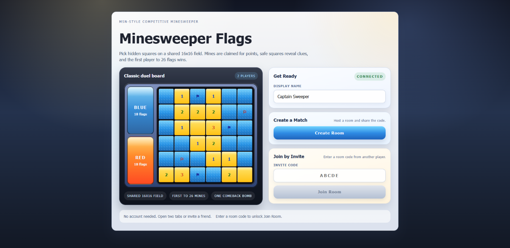
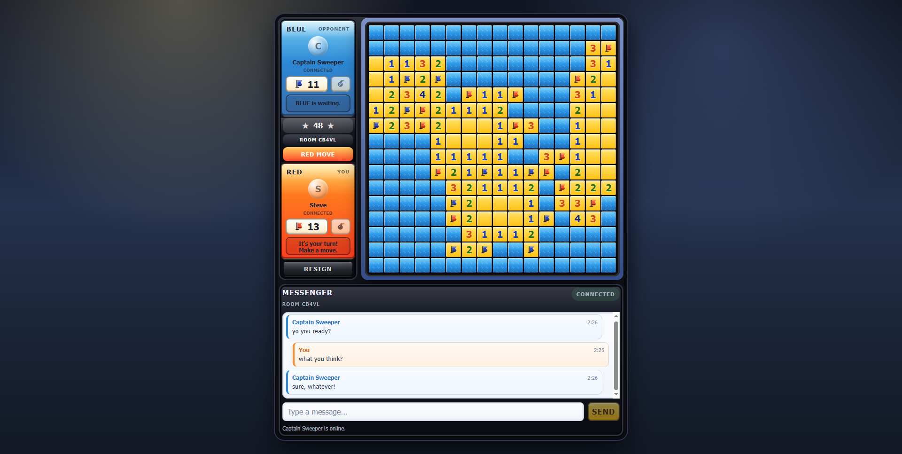

# Minesweeper Flags

This is an homage to the MSN Messenger game I used to play with friends back in the day.  A realtime two-player competitive Minesweeper with room-scoped match chat, built as a small monorepo with a React client, a Node WebSocket server, and shared game/protocol packages.

The game flow is simple:

- player one creates a room
- player two joins with a private invite link or invite token
- both players share a 16x16 board with 51 mines
- first to 26 claimed mines wins
- each player gets one 5x5 bomb comeback move that unlocks only while trailing by 4 or more
- room chat stays with the room through reconnects and rematches

## Screenshots

### Lobby



### Match



## Stack

- React + Vite client in `apps/client`
- Node + `ws` realtime server in `apps/server` (hosted server flow)
- Lightweight HTTP signaling service in `apps/signaling` (browser-to-browser direct match flow)
- shared protocol/types in `packages/shared`
- pure game logic in `packages/game-engine`
- optional Redis-backed state persistence for rooms, matches, chat history, and reconnect sessions

The client ships in two product shapes selected at build time:

- `VITE_DEPLOYMENT_MODE=server` — hosted realtime server, room codes and invite links
- `VITE_DEPLOYMENT_MODE=p2p` — browser-to-browser direct matches over WebRTC, with the host browser as the gameplay authority and `apps/signaling` only used for offer/answer/reconnect rendezvous

## Architecture

- the server routes websocket input through a transport-neutral command layer before binding direct events and room broadcasts back to sockets
- the client separates controller behavior, runtime store, transport wiring, and the thin React provider boundary
- shared protocol modules distinguish commands, direct events, and room-stream events without changing the wire contract

## Quick Start

Install dependencies:

```bash
make install
```

Run the app locally in dev mode:

```bash
make dev
```

That starts:

- the server in watch mode
- the Vite client in watch mode

For the convenience local Compose stack:

```bash
make compose-up
```

For the parity-first stack that matches the public deployment shape more closely:

```bash
make compose-public-up
```

For the local direct-match (P2P) stack with the signaling service instead of the hosted server:

```bash
make compose-p2p-up
```

For the parity/public direct-match stack:

```bash
make compose-public-p2p-up
```

Then open:

- `http://localhost:8080` for either Compose stack
- `ws://localhost:3001/ws` as the explicit backend socket URL in the parity stack
- the Vite URL printed by `make dev` for client-only dev mode

## Useful Commands

```bash
make help
make dev
make server-dev
make test-server
make build
make compose-config
make compose-up
make compose-down
make compose-public-config
make compose-public-up
make compose-public-down
make check
```

## Configuration

The main configuration reference is:

- [docs/config-reference.md](docs/config-reference.md)

Example env templates:

- [apps/server/.env.example](apps/server/.env.example)
- [apps/client/.env.example](apps/client/.env.example)
- [apps/client/.env.production.example](apps/client/.env.production.example)
- [deploy/container/public.env.example](deploy/container/public.env.example)

Important behavior:

- the server does not auto-load `.env` files on its own
- `make dev`, `make server-dev`, and `make server-start` load `apps/server/.env` if it exists
- the client uses Vite build-time env vars such as `VITE_SOCKET_URL`
- the server defaults to `STATE_BACKEND=memory`
- `DEPLOYMENT_MODE=public` requires `STATE_BACKEND=redis`, explicit `WEBSOCKET_ALLOWED_ORIGINS`, and `TRUST_PROXY=true`
- local Docker Compose runs the server with Redis enabled
- the parity/public Compose overlay keeps frontend and backend on split origins, matching the public deployment model

## Local Development Modes

### Fast iteration

Use:

```bash
make dev
```

This is the simplest workflow when you are editing UI or server logic.

### Convenience Redis-backed local testing

Use:

```bash
make compose-up
```

This gives you:

- `redis`
- `server`
- `client`

The Compose client proxies `/ws` to the server, so same-origin play works out of the box.

### Parity-first local testing

Use:

```bash
make compose-public-up
```

This uses the baked-in localhost-safe defaults from [`deploy/container/docker-compose.public.yml`](deploy/container/docker-compose.public.yml).
It is the recommended path before a public deploy. It gives you:

- `redis`
- `server`
- `client`
- `DEPLOYMENT_MODE=public`
- explicit `VITE_SOCKET_URL`
- split frontend/backend origins

To override the parity/public defaults with your own env file, run:

```bash
docker compose --env-file deploy/container/public.env.example -f deploy/container/docker-compose.public.yml up --build
```

See [deploy/container/README.md](deploy/container/README.md) for the env contract and public-hosting assumptions.

## Testing

Run everything:

```bash
make test
```

Run only the server suite:

```bash
make test-server
```

Run only the client suite:

```bash
make test-client
```

The server currently has coverage around:

- realtime connection handling
- abuse prevention and rate limiting
- reconnect/session behavior
- state-store behavior for memory and Redis-backed paths
- health/readiness behavior
- room-scoped concurrency and rematch/cleanup race regressions

The client currently has coverage around:

- provider/controller/store integration
- session persistence and reconnect bootstrap behavior
- rematch UI state changes
- bomb availability and board-preview behavior
- direct-match (P2P) host/guest setup, refresh recovery, displacement and duplicate-tab handling

The signaling service has coverage around:

- offer/answer/finalization session lifecycle and TTL
- reconnect control sessions, role claims, heartbeat staleness, and stale-attempt reconciliation

## Health And Realtime Behavior

The backend exposes:

- `/health` for liveness (also returns `activeRooms` / `maxRooms` slot availability)
- `/ready` for readiness

The realtime server includes:

- room create/join flows over WebSockets
- room-scoped live chat with reconnect-safe recent history
- reconnect support with stored session tokens
- configurable max concurrent rooms with lobby slot indicator
- per-IP connection caps and event throttling
- immediate room cleanup when all players disconnect
- heartbeat-based stale socket cleanup
- optional Redis-backed persistence
- strict public-mode config validation

## Repo Layout

```text
apps/
  client/         React + Vite frontend (server and p2p builds)
  server/         Node realtime server (hosted flow)
  signaling/      Lightweight HTTP signaling service (p2p flow)
packages/
  game-engine/    Pure game rules and board logic
  shared/         Shared schemas, DTOs, and protocol definitions
docs/
  config-reference.md
deploy/
  container/       parity/public compose overlay and docs
Makefile
docker-compose.yml
docker-compose.p2p.yml
```

## Notes

- Use `make dev` for fast editing and `make compose-public-up` for production-like validation.
- Public deployments are currently single-instance only and should use Redis.
- Multi-instance fanout is not implemented yet, so horizontal scaling still needs more work.
